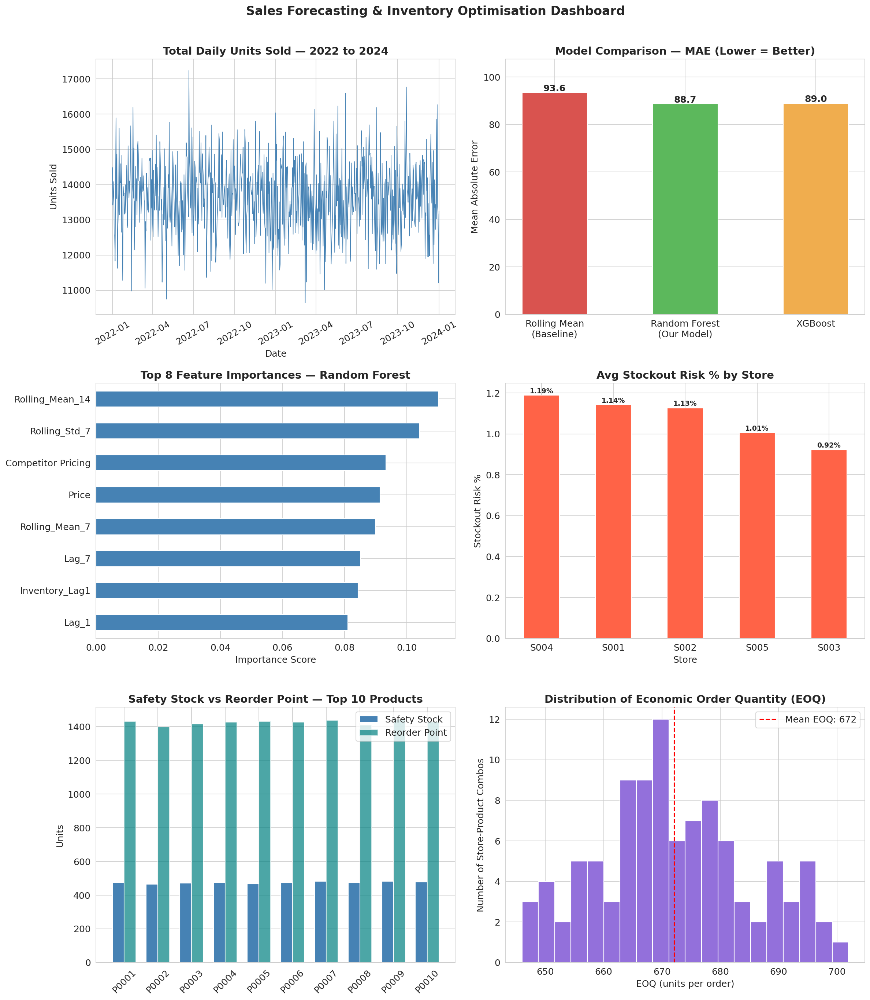
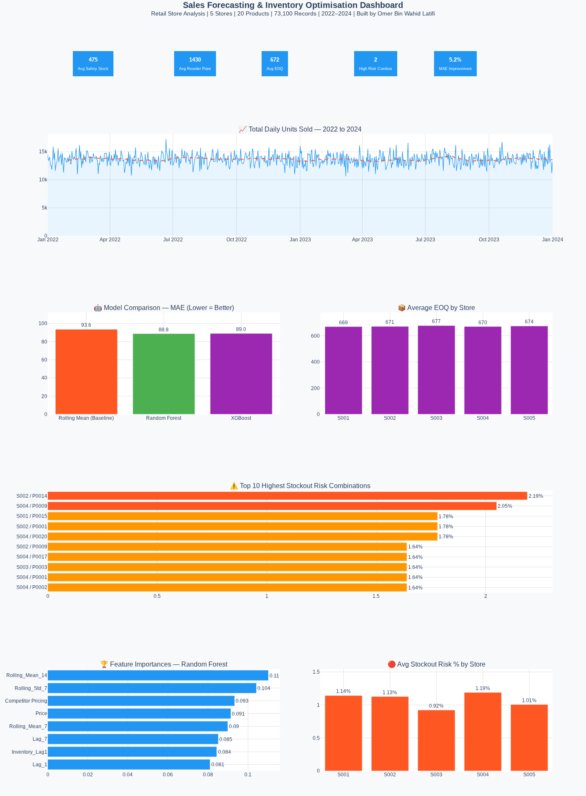

# 📦 Sales Forecasting & Inventory Optimisation System

---

## 📌 Project Overview

A full end-to-end data analytics and machine learning project that forecasts
retail product demand and recommends optimal inventory levels across 5 stores
and 20 products.

The project answers two core business questions:
- **When will we run out of stock — and for which products?**
- **How much should we order, and when should we reorder?**

---

## 🖼️ Dashboards

### Static Analysis Dashboard (Matplotlib)

### Interactive Inventory Dashboard (Plotly)

> 📂 Open `outputs/inventory_dashboard.html` in any browser
> for the fully interactive version

---

---

## 📊 Dataset

| Property | Detail |
|---|---|
| Source | Kaggle — Retail Store Inventory Forecasting Dataset |
| Rows | 73,100 |
| Columns | 15 |
| Date Range | January 2022 — January 2024 |
| Stores | 5 (S001–S005) |
| Products | 20 (across 5 categories) |
| Key Fields | Units Sold, Inventory Level, Price, Discount, Promotions, Weather |

---

## 🔧 Tools & Technologies

| Tool | Purpose |
|---|---|
| Python (Google Colab) | Data cleaning, EDA, feature engineering, ML modelling |
| Pandas / NumPy | Data manipulation and numerical computation |
| Scikit-learn | Random Forest model, evaluation metrics |
| XGBoost | Gradient boosting model for comparison |
| Plotly | Interactive HTML dashboard |
| Matplotlib / Seaborn | Static EDA and analysis charts |
| SQL (SQLite Online) | Business queries — aggregations, CTEs, window functions |
| Google Sheets | Pivot summary and KPI table |

---

## 🚀 Project Workflow

### Step 1 — Data Loading & Inspection
- Loaded 73,100 rows × 15 columns
- Confirmed zero missing values and zero duplicate rows
- Identified 673 negative values in `Demand Forecast` column

### Step 2 — Data Cleaning
- Clipped negative `Demand Forecast` values to 0
- Validated no impossible logic (Units Sold never exceeded Inventory Level)
- Converted `Date` column to datetime format

### Step 3 — Feature Engineering
Created 11 new features including:
- **Lag features** (Lag_1, Lag_7) — yesterday and last week's sales
- **Rolling features** (7-day and 14-day rolling mean and std)
- **Date features** (Month, DayOfWeek, WeekOfYear)
- **Business features** (Revenue, Forecast Error, Stock Cover Days)
- **Risk flags** (Is_Low_Stock, Price Gap vs Competitor)

### Step 4 — Exploratory Data Analysis
Key findings:
- Demand is **largely stochastic** — no strong seasonality or weekly pattern
- Sales are consistent across categories (135–138 avg units)
- Promotions showed **no measurable uplift** in this dataset
- **Low stock periods correlated with significantly reduced sales**
  (26.7 vs 137.7 avg units) — evidence of lost sales due to stockouts

### Step 5 — Demand Forecasting Model
- Built a **global ML model** across all 100 store-product combinations
- Identified and corrected **data leakage** from the Inventory Level feature
- Compared three approaches:

| Model | MAE | RMSE | vs Baseline |
|---|---|---|---|
| Rolling Mean (Baseline) | 93.59 | 115.50 | — |
| **Random Forest** | **88.75** | **107.85** | **+5.2% improvement** |
| XGBoost | 88.98 | 108.25 | +4.9% improvement |

**Random Forest selected as final model** with 19 features,
no single feature dominating (max importance: 11%).

### Step 6 — Inventory Optimisation Engine
Calculated for all 100 store-product combinations using industry formulas:

| Metric | Formula | Avg Value |
|---|---|---|
| Safety Stock | Z × σ × √(Lead Time) | 475 units |
| Reorder Point | (Avg Demand × Lead Time) + Safety Stock | 1,430 units |
| EOQ | √(2 × Annual Demand × Order Cost / Holding Cost) | 672 units |
| Stockout Risk | % of days below 20% of avg inventory | ~1.1% |

**Assumptions:** 7-day supplier lead time, 95% service level,
£50 order cost, 20% annual holding cost rate.

**Key finding:** All 100 store-product combinations are currently
operating below their calculated reorder points — meaning the retail
network is understocked relative to optimal inventory levels
at a 95% service level.

---

## 🔍 SQL Analysis

7 queries written and validated in SQLite Online covering:

| Query | Skill |
|---|---|
| Stores below reorder point | Aggregation, filtering |
| Top 10 stockout risk combos | ORDER BY, LIMIT |
| Revenue by category & region | Multi-column GROUP BY |
| Safety stock & EOQ by store | AVG, ROUND |
| Monthly sales trend per store | Date functions |
| Running total revenue per store | Window functions (SUM OVER) |
| Chronic understocking with CTE | CTE + subquery |

---

## 💡 Key Business Insights

1. **Lost sales from stockouts:** When inventory is critically low,
   average daily sales drop from 137.7 to 26.7 units — strong evidence
   that stockouts are suppressing revenue, not just reflecting low demand.

2. **All stores are understocked:** Current average inventory (~274 units)
   falls well below the calculated reorder point (~1,430 units) for every
   store-product combination at a 95% service level.

3. **Highest risk products:** S002/P0014 (2.19%) and S004/P0009 (2.05%)
   have the highest stockout risk and require immediate attention.

4. **Demand is volatile but stable:** High day-to-day variance (std ~108)
   relative to mean (~136) confirms large safety stock buffers are
   justified and necessary.

---

## 📈 How to Run

1. Clone this repository
2. Open `notebooks/sales_forecasting_inventory.ipynb` in Google Colab
3. Upload `data/retail_store_inventory.csv` when prompted
4. Run all cells in order (top to bottom)
5. Open `outputs/inventory_dashboard.html` in any browser
   for the interactive dashboard

---

## 👤 Author

**Omer Bin Wahid Latifi**
MSc Data Science & Analytics — University of Hertfordshire
🔗 [LinkedIn Profile](https://www.linkedin.com/in/omer-latifi/) 

---

## 📜 Licence

This project is for portfolio and educational purposes.
Dataset sourced from Kaggle under public licence.
